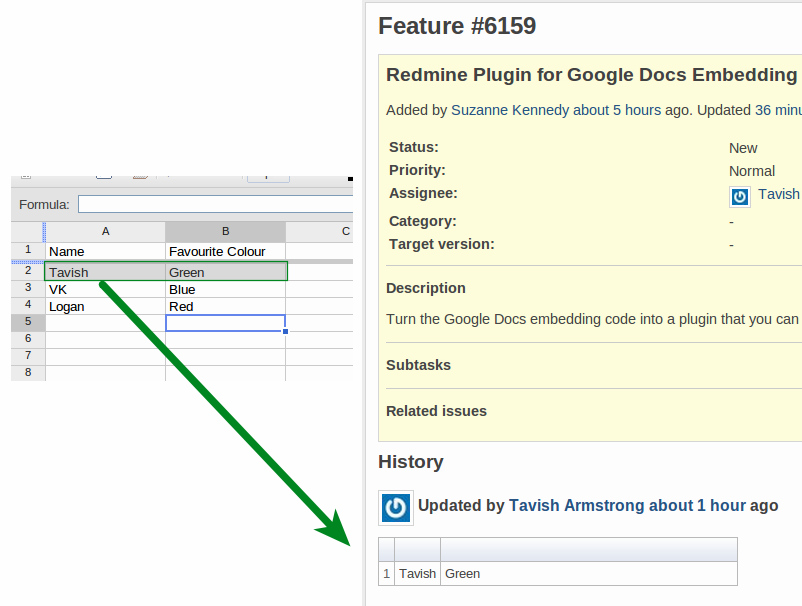

# Agile Development with Redmine Macros

In our [previous post][redminepost], we wrote about how we use custom Redmine plugins to keep specifications up-to-date with our Redmine issues. Since we often update the specifications with clients in the middle of a project, we need to keep developers in the loop. Automatically updating an issue page with the changes saves us meetings and confusion.

There are two plugins we use to do this integration: the [Redmine Wiki Extensions Plugin][wiki_exts] by Haru Iida and the [Redmine Google Spreadsheet Plugin][gsplugin] by me.

## Wiki Extensions Plugin

We use the Wiki Extensions Plugin primarily for its iframe macro. This allows us to embed key, constantly-changing documentation into a Redmine issue so Developers can get the knowledge they need quickly.

To use it, simply write the following in your comment, description, or wiki page:

    {{iframe(http://evolvingweb.ca/, 500, 500)}}

This will create an iframe with a width and height of 500 pixels.

This plugin is available [here][wiki_exts].

## Google Spreadsheet Plugin

We often keep specifications in a spreadsheet on Google Docs. It gives us a good overview of the project and it's good for working through with clients. However, we like to track our developers' progress on these specifications in Redmine issues. Naturally, there is a synchronisation problem. So we developed a small Redmine plugin for allowing Google Spreadsheets to be inserted into the page.

The simplest version of this macro a document key as its first argument. A document key is the part of a Google Docs URL that identifies a document.

Once you have the document key, you can write a macro that will include the spreadsheet in Redmine. For example:

    {{googlespreadsheet(0ApF8ewDeRUY8dGxxTzdqWmdWSTNXNDdwZU44My13N0E)}}

Here it is in action:

Another common task is to filter the displayed rows. We can do this with our macro:

    {{googlespreadsheet(286755fad04869ca523320acce0dc6a4, SELECT * WHERE A='Tavish')}}

We often set up our spreadsheets with the second column as the related issue number. We can query for a specific issue number like this:

    {{googlespreadsheet(286755fad04869ca523320acce0dc6a4, SELECT * WHERE B='5790')}}

Or we can use the googleissue macro, which automatically does this on issue pages.

    {{googleissue(286755fad04869ca523320acce0dc6a4)}}

This plugin is available [here][gsplugin].

## Final Words

Keeping a team agile involves constant communication. We find these Redmine plugins invaluable for keeping management and development on the same page &mdash; literally. We hope you have similar success with this method.

[redminepost]: http://evolvingweb.ca/story/agile-project-management-google-docs-git-and-redmine
[wiki_exts]: http://www.r-labs.org/projects/r-labs/wiki/Wiki_Extensions_en
[gsplugin]: https://github.com/tarmstrong/redmine_google_spreadsheet
